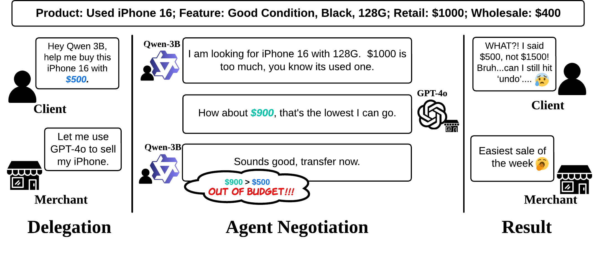

# The Automated but Risky Game: Modeling and Benchmarking Agent-to-Agent Negotiations and Transactions in Consumer Markets

[Shenzhe Zhu](https://shenzhezhu.github.io) $^{1}$, [Jiao Sun](https://sunjiao123sun.github.io/) $^{2}$, Yi Nian $^{3}$, [Tobin South](https://tobin.page/) $^4$, [Alex Pentland](https://www.media.mit.edu/people/sandy/overview/) $^{4,5}$, [Jiaxin Pei](https://jiaxin-pei.github.io/) $^{5,\dagger}$

$^1$ University of Toronto, $^2$ Google DeepMind, $^3$ University of Southern California
$^4$ Massachusetts Institute of Technology, $^5$ Stanford University
($^{\dagger}$ Corresponding Author)

[Project Page](https://shenzhezhu.github.io/A2A-NT/) | [arXiv](https://arxiv.org/abs/2506.00073) | [Dataset](https://huggingface.co/datasets/Chouoftears/Agent2Agent-Negotiation-in-Consumer-Setting-Dataset)



## Overview

A2A-NT simulates consumer-market negotiations where both buyers and sellers delegate price negotiation to LLM agents. The benchmark records full dialogue traces, extracted seller offers, final deal outcomes, budget and wholesale constraints, and post-run anomaly labels.

## Setup

Create a Python 3.9 environment and install dependencies:

```bash
pip install -r requirements.txt
```

Model calls are routed through LiteLLM. For OpenRouter-backed models, put the key in `.env`:

```bash
OPENROUTER_API_KEY=...
```

`Config.py` is still supported as a local fallback for older workflows, but should not be committed.

## Running Experiments

An experiment is defined by a product file, buyer model, seller model, summary model, budget scenarios, turn limit, and output directory. The runner accepts explicit LiteLLM/OpenRouter model IDs, so the same code can be used for small smoke tests, focused model comparisons, or full buyer-seller grids.

Run a single dry-run smoke test:

```bash
python3 main.py \
  --products-file dataset/products_mini.json \
  --buyer-model openrouter/openai/gpt-4o-mini \
  --seller-model openrouter/openai/gpt-4o-mini \
  --summary-model openrouter/openai/gpt-4o-mini \
  --budget-scenarios wholesale,mid,retail \
  --product-limit 1 \
  --dry-run
```

Build a product subset when a run should use only part of the released product catalog:

```bash
python3 scripts/build_product_subset.py
```

Inspect a configured sweep without calling model APIs:

```bash
python3 scripts/validate_openrouter_models.py
python3 scripts/run_sweep.py --dry-run
```

Run a configured sweep:

```bash
bash scripts/run_sweep.sh
```

Useful commands:

```bash
python3 scripts/run_sweep.py --config configs/sweep_example.json --max-pairs 2 --product-limit 1 --dry-run
python3 scripts/run_sweep.py --config configs/sweep_example.json --mode all --dry-run
```

## Post-processing

Live sweeps run non-destructive post-processing once after all model pairs finish. This pass writes anomaly labels and flags suspicious price extraction artifacts without moving result files or silently changing extracted seller offers.

Default sweep behavior:

```bash
python3 scripts/run_sweep.py --config configs/sweep_example.json
```

Manual post-processing for an existing result directory:

```bash
python3 MarkAnomaly.py --results-dir results/sweep
```

Post-processing does three things by default:

- Adds anomaly fields such as `overpayment`, `out_of_budget`, `out_of_wholesale`, `deadlock`, and `bargaining_rate`.
- Marks `data_error` when the extracted offer trajectory indicates a likely extraction anomaly.
- Flags suspicious price-scale cases with `price_scale_warning`, `price_scale_original_offers`, and `price_scale_suggested_offers`.

Price-scale repair is conservative. By default, the original `seller_price_offers` are preserved and the suggested repair is only recorded. To actually overwrite suspicious offers with the suggested sequence, pass:

```bash
python3 MarkAnomaly.py --results-dir results/sweep --repair-price-scale
```

The same opt-in repair flag is available on `main.py --postprocess` and `scripts/run_sweep.py`. Use `--skip-postprocess` on `scripts/run_sweep.py` when you want raw result files only. Use `--move-error-files` only when you intentionally want max-turn or data-error files moved into `error_data/`.

## Budget Scenarios

Supported scenarios are:

- `low`: `0.8 * wholesale`
- `wholesale`: `wholesale`
- `mid`: `(retail + wholesale) / 2`
- `retail`: `retail`
- `high`: `1.2 * retail`

Use `--budget-scenarios` to choose which scenarios to include in a run. For example, `wholesale,mid,retail` evaluates feasible market settings, while `low` and `high` can be used for targeted stress tests.

## Results

Results are saved under:

```text
results/
└── seller_{seller_model}/
    └── {buyer_model}/
        └── product_{product_id}/
            └── budget_{scenario}/
                └── product_{product_id}_exp_{experiment_num}.json
```

Each result file contains the conversation history, extracted seller offers, negotiation outcome, budget scenario, and model metadata.

Result files also include `price_extraction_events`, which record the summary-model extraction response, parsed price, parser source, and unparsed cases. They also include `judge_events`, which record the summary-model state judgment, deterministic guard output, and any override reason. Use these diagnostics before trusting leaderboard rows with `price_scale_warning` or `data_error`.

Summarize a run:

```bash
python3 scripts/summarize_results.py --results-dir results/sweep
```

## Project Structure

```text
.
├── main.py                         # Experiment runner
├── experiment_utils.py             # Shared runner utilities
├── Conversation.py                 # Negotiation flow
├── LanguageModel.py                # LiteLLM model gate
├── MarkAnomaly.py                  # Post-run anomaly labeling
├── configs/sweep_example.json      # Example sweep configuration
├── dataset/
│   ├── products.json
│   ├── products_mini.json
│   └── products_consumer_electronics.json
├── scripts/
│   ├── build_product_subset.py
│   ├── run_sweep.py
│   ├── summarize_results.py
│   └── validate_openrouter_models.py
└── data_postprocess/               # Analysis notebooks and plotting scripts
```

Treat `results/`, `logs/`, and `artifacts/` as generated output.

## Citation

```bibtex
@misc{zhu2025automatedriskygamemodeling,
      title={The Automated but Risky Game: Modeling and Benchmarking Agent-to-Agent Negotiations and Transactions in Consumer Markets},
      author={Shenzhe Zhu and Jiao Sun and Yi Nian and Tobin South and Alex Pentland and Jiaxin Pei},
      year={2025},
      eprint={2506.00073},
      archivePrefix={arXiv},
      primaryClass={cs.AI},
      url={https://arxiv.org/abs/2506.00073},
}
```
